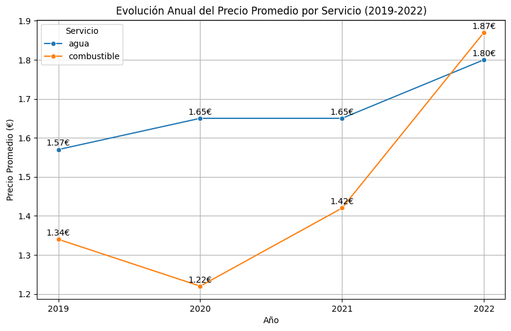
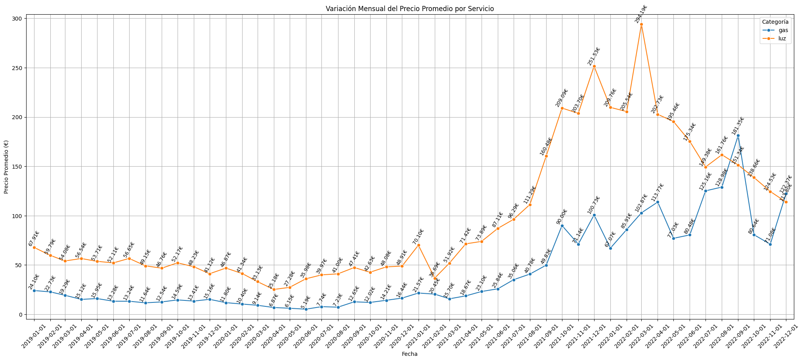
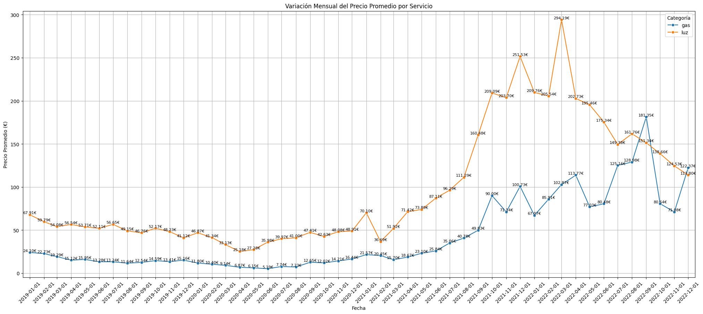
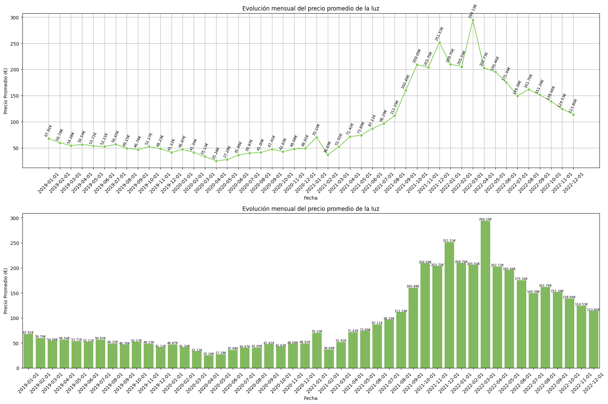
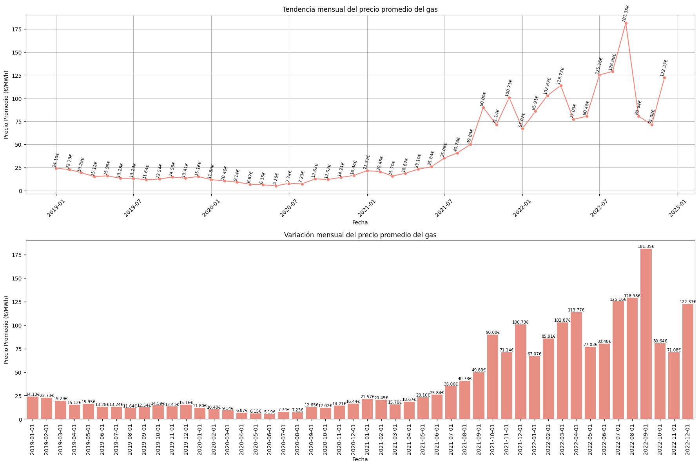
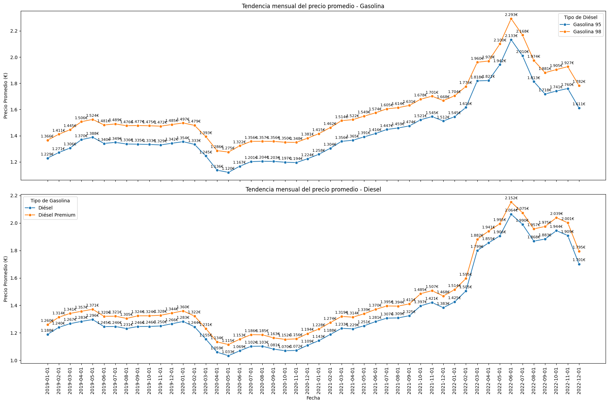
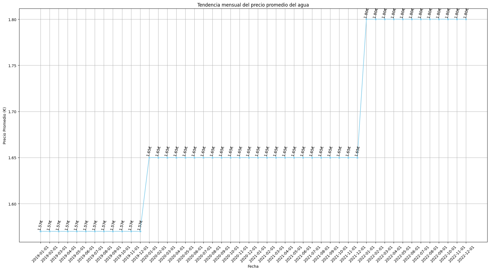

# 📊 Evolución de los Precios de Agua, Luz, Gas y Combustibles en la Comunidad de Madrid (2019-2022)

## 🎯 Objetivo
Analizar la evolución de los precios de la luz, gas, agua y combustibles en la Comunidad de Madrid entre 2019 y 2022, observando el impacto del COVID-19 y otros factores que pudieron causar un aumento de precios, especialmente después de 2021.

# 📊 Análisis de las Gráficas 📊
## 1. 📈 Evolución Anual del Precio Promedio por Servicio (2019-2022)

### Observaciones:
- **Agua**💧: El precio promedio del agua se mantuvo estable entre 2019 y 2021 (1.57€ a 1.65€), con un aumento notable en 2022 a 1.80€. Este incremento, aunque moderado en comparación con otros servicios, impacta el coste de vida dado su carácter esencial.
- **Combustible**⛽: Después de una bajada notoria en 2020 (1.22€) por la caída de la demanda durante la pandemia, los precios se dispararon en 2021 y 2022, alcanzando 1.87€ en 2022. La recuperación económica y la alta demanda global impulsaron estos aumentos, exacerbados por las restricciones en la oferta y las tensiones internacionales en el sector energético.

---

## 2. 📉 Variación Mensual del Precio Promedio por Servicio (2019-2022)

### Observaciones:
- **Agua**💧: Mantiene una estabilidad considerable en su precio mensual hasta 2022. Este servicio esencial experimenta un aumento en el último año, probablemente relacionado con la inflación en el coste de mantenimiento y distribución.
- **Combustibles**⛽: Muestran una gran variabilidad mensual, con aumentos significativos hacia finales de 2021 y 2022, vinculados con problemas de suministro y el encarecimiento de las materias primas como el petróleo.

---

## 3. ⚡ Variación Mensual del Precio Promedio de Luz y Gas (2019-2022)

### Observaciones:
- **Luz**💡: Observamos un incremento sostenido en 2021, alcanzando máximos históricos a finales de ese año, y se estabiliza en niveles altos en 2022. Las causas incluyen la creciente demanda de gas natural (utilizado en muchas plantas de generación de electricidad) y el aumento de precios de los derechos de emisión de CO₂ en la Unión Europea, que afectaron el coste de generación.
- **Gas**🔥: Los precios del gas se mantienen relativamente estables hasta principios de 2021, cuando comienzan a escalar significativamente, llegando a un máximo en octubre de 2022. Esta subida está directamente vinculada a la dependencia europea del gas natural ruso y a las interrupciones de suministro derivadas del conflicto en Ucrania y las sanciones impuestas.

---

## 4. 💡 Evolución Mensual del Precio de la Luz

### Observaciones:
- La electricidad ha experimentado una volatilidad extrema, sobre todo a partir de 2021. Los precios subieron rápidamente debido a varios factores, entre ellos:
  - **Aumento de la demanda de gas natural**: Al ser el gas una fuente primaria para la generación de electricidad en Europa, el aumento en sus precios encarece directamente la electricidad.
  - **Mercado de CO₂**🌍: El sistema de comercio de emisiones de la UE incrementa el coste de emisión de gases contaminantes, lo cual encarece la generación de electricidad en plantas tradicionales.
  - **Limitaciones de infraestructura**: La dependencia de fuentes renovables intermitentes como la energía eólica o solar, que no siempre pueden suplir la demanda, obliga a recurrir a plantas de energía más caras.

---

## 5. 🔥 Evolución Mensual del Precio del Gas

### Observaciones:
- El precio del gas se ha disparado desde mediados de 2021, alcanzando picos a mediados de 2022. Los principales factores detrás de esta subida son:
  - **Conflicto en Ucrania**: La guerra entre Rusia y Ucrania y las subsecuentes sanciones han afectado el suministro de gas a Europa, lo que generó escasez y un aumento de precios.
  - **Alta demanda post-pandemia**📈: La recuperación económica global aumentó la demanda de gas, creando un desbalance entre oferta y demanda en un momento de limitación en los recursos.
  - **Capacidad limitada de almacenamiento**: Europa no tenía suficiente capacidad de almacenamiento de gas para compensar la reducción en el suministro, lo cual exacerbó las subidas de precios.

---

## 6. ⛽ Evolución Mensual del Precio de los Combustibles (Gasolina y Diésel)

### Observaciones:
- Tanto la gasolina como el diésel muestran incrementos significativos a partir de mediados de 2021, alcanzando máximos en 2022. Estos incrementos se explican por:
  - **Subida en el precio del crudo**: El petróleo, materia prima clave, se ha encarecido debido a la menor producción y a la incertidumbre geopolítica.
  - **Crisis en la cadena de suministro**🛢️: Las dificultades logísticas globales y el aumento de los costes de transporte han impactado los precios.
  - **Política energética global**🚢: Los intentos de transición hacia energías limpias han llevado a una reducción en inversiones en petróleo, limitando la capacidad de producción frente a una alta demanda.

---

## 7. 💧 Evolución Mensual del Precio del Agua

### Observaciones:
- El precio del agua se ha mantenido estable, con un incremento modesto en 2022. A diferencia de los combustibles y la electricidad, el agua ha sido menos afectada por factores de mercado y geopolíticos, debido a su carácter local y su menor dependencia de los mercados globales.

---

## 📌 Conclusión

Este análisis muestra cómo los precios de productos esenciales como la luz 💡, el gas 🔥 y los combustibles ⛽ han experimentado aumentos drásticos entre 2021 y 2022, impulsados por factores como la crisis energética, el conflicto en Ucrania 🇺🇦 y la alta demanda post-COVID 📈. La electricidad y el gas, en particular, han sido afectados por la dependencia de Europa en energías importadas y por la volatilidad en el mercado de emisiones de CO₂ 🌍. 

El agua 💧, en cambio, ha mostrado una mayor estabilidad, aunque también ha tenido un leve incremento en 2022.

### 💰 Impacto en el Costo de Vida
El aumento en los precios de estos productos esenciales afecta directamente el coste de vida. Luz, gas y combustibles son bienes que no podemos dejar de consumir, y sus aumentos se reflejan en facturas más altas 🧾, lo cual reduce el poder adquisitivo y eleva el costo de vida 📉. Además, el incremento en el precio de la energía tiene un efecto en cadena, encareciendo también la producción y el transporte de bienes y servicios.

En conclusión, el encarecimiento de estos bienes plantea un desafío para la economía doméstica, sobre todo para las familias con ingresos limitados. La presión sobre los presupuestos familiares obliga a reducir el gasto en otras áreas, afectando la calidad de vida general. Esto subraya la importancia de políticas que aseguren la accesibilidad y estabilidad de estos servicios básicos 🔄, para mitigar el impacto en la población y promover una vida más sostenible y accesible.